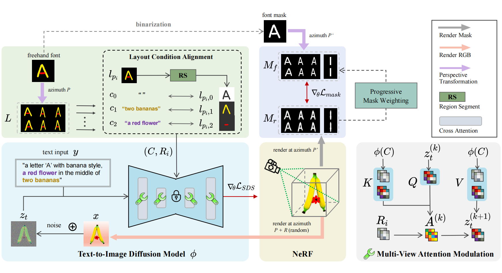
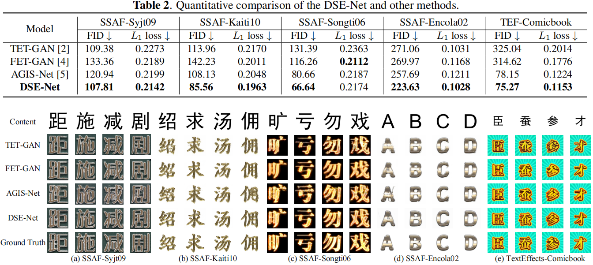

> **Xiang Li, Lei Wu*, Xu Chen, Lei Meng*, Xiangxu Meng**
>
> **School of Software, Shandong University, China**

# Abstract

Recently, the artistic font generation has made significant progress. However, existing methods typically treat the style of artistic font as a whole. Their performance is usually limited to the artistic fonts with complex style elements in glyph and text effect. To solve these problems, this paper presents a disentangled style encoding network, termed DSE-Net, to synthesize artistic fonts. In order to obtain the disentangled text effect features, we introduce a perspective transformation network. We propose a cross-layer fusion mechanism to improve the artistic fonts’ structure and texture according to their different representations in CNN. Notably, encoding different style elements for artistic font generation is a new task, so there is no publicly-accessible dataset. Therefore, a new dataset, termed SSAF, has been constructed. Extensive experiments demonstrate that our model significantly outperforms the state-of-the-art methods, with more fine-grained text effect and accurate stroke details.

# Method

# Results
