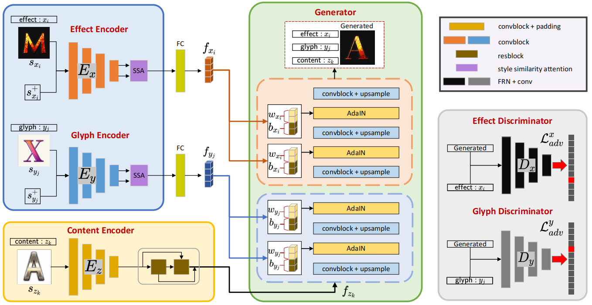
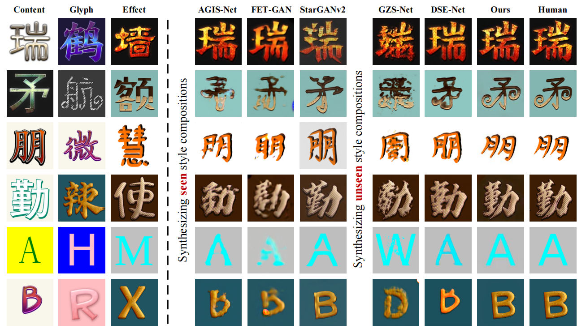

> **Xiang Li, Lei Wu\*, Changshuo Wang, Lei Meng\*, Xiangxu Meng**
> 
> **School of Software, Shandong University, China**

# Abstract

本文提出了一种新的组合式零样本艺术字体生成模型 (CAFS-GAN)，通过探索字形与效果之间编码语义的视觉独立性和联合兼容性，实现了对未见风格组合的合成。

# Method

# Results
