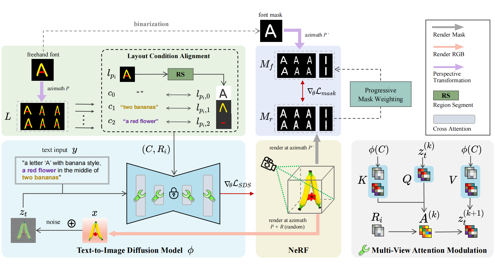

> **Xiang Li, Lei Meng, Lei Wu\*, Manyi Li, Xiangxu Meng**
>
> **School of Software, Shandong University, China**

# Abstract

本文提出了一种新颖的文本到 3D 字体生成模型，它允许文本提示描述3D字体样式，字体蒙版或手绘字体布局来约束多视图下的3D字体结构，实现了3D艺术字体的生成和局部效果的控制。

# Method

# Results
