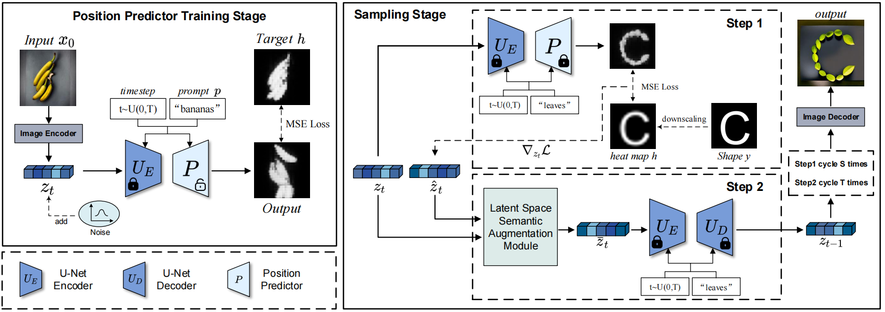
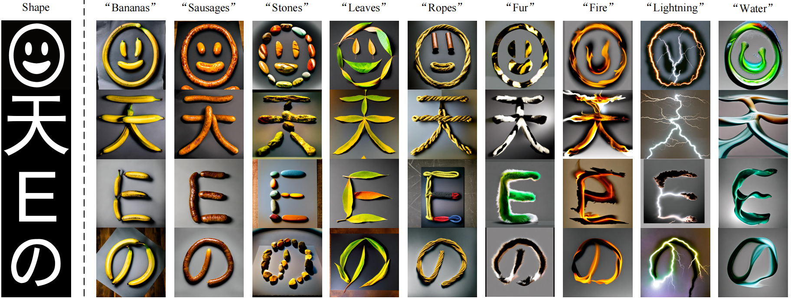

> **Changshuo Wang, Lei Wu\*, Xiaole Liu, Xiang Li, Lei Meng\*, Xiangxu Meng**
>
> **School of Software, Shandong University, China**

# Abstract

本文提出了一种使用预训练的文本到图像扩散模型生成创造性艺术字体的新方法。我们的模型以形状图像和描述对象的提示词作为输入，并生成由这些对象组成的艺术字体图像。

# Method

# Results
